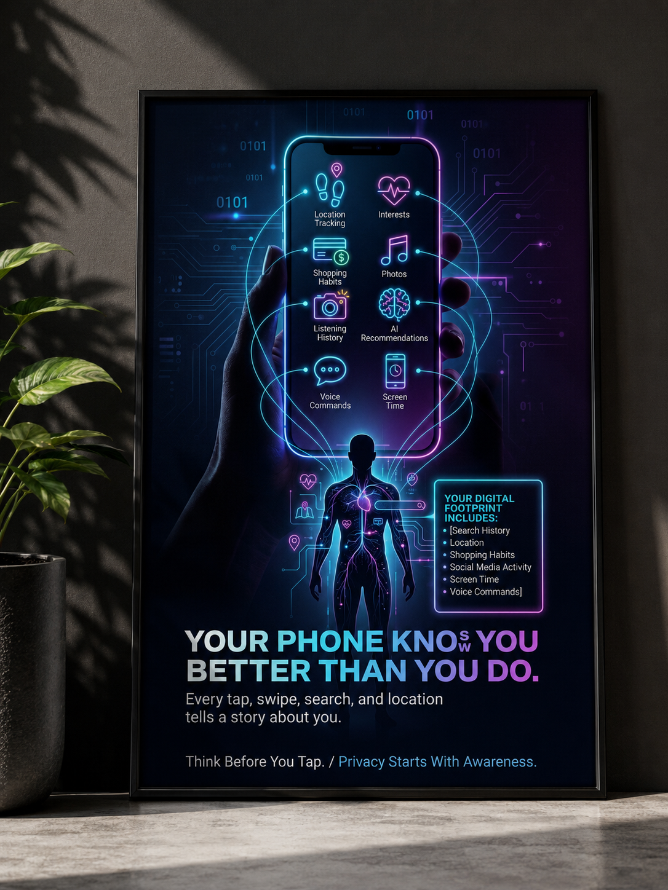

# digital-privacy-awareness-poster


# 📱 Your Phone Knows You Better Than You Do

A modern cyberpunk-inspired awareness poster highlighting the importance of **digital privacy** and **digital footprints**. This poster visually communicates how smartphones collect personal data through everyday activities such as searches, location tracking, shopping habits, screen time, and voice commands.



---

## 📌 Project Overview

This poster was created as **Day 1** of my **20 Days Print Design Challenge**.

The goal was to design an eye-catching awareness poster that combines futuristic visuals with strong typography and a clear information hierarchy.

---

## 🎯 Design Objective

Create a visually engaging print poster that educates viewers about:

- Digital Footprints
- Data Privacy
- Smartphone Tracking
- Online Awareness
- Cybersecurity

---

## ✨ Features

- Modern Cyberpunk Theme
- Neon Blue & Purple Color Palette
- Strong Visual Hierarchy
- Minimal but Informative Layout
- Print-Ready Design
- High Contrast Typography
- Social Awareness Concept

---

## 🛠️ Tools Used

- Adobe Photoshop
- Canva
- AI-Assisted Design Workflow

---

## 🎨 Design Elements

### Typography
- Bold Sans-serif Headlines
- Clean Readable Body Text
- High Contrast Font Pairing

### Color Palette

| Color | Purpose |
|--------|----------|
| Neon Blue | Technology |
| Purple | Innovation |
| Dark Navy | Background |
| White | Readability |

---

## 📖 Poster Message

> **Your Phone Knows You Better Than You Do.**

Every tap, swipe, search, and location creates a digital footprint. The design encourages users to become more aware of the information they share online.

---

## 📂 Project Structure

```
Poster-Design/
│
├── poster.png
├── mockup.jpg
├── README.md
└── assets/
```

---

## 💡 Skills Demonstrated

- Print Design
- Poster Design
- Typography
- Visual Hierarchy
- Layout Design
- Color Theory
- Branding
- Graphic Design

---

## 🚀 Challenge

This project is part of my:

**20 Days Print Design Challenge**

Day 1 ✅

---

## 📸 Preview

Replace the image below with your exported poster.

```
poster.png
```

---

## 👩‍💻 Designer

**Shraddha**

Founder of **Pixel Aura Studio**

Graphic Designer | Print Designer | Brand Designer

---

## 📬 Connect With Me

- LinkedIn
- Behance
- Instagram
- GitHub

---

⭐ If you like this project, consider giving it a **Star** and sharing your feedback!
